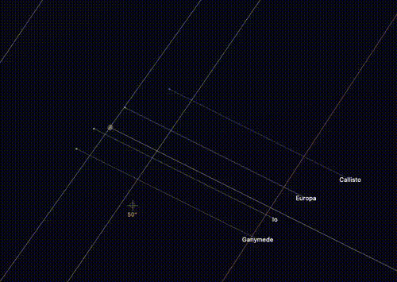

# Once Around the Night Sky

An interactive celestial visualizer for Paul Fellows' excellent [Once Around](https://www.youtube.com/@oncearound) series of astronomy YouTube videos.

<p align="center">
  <a href="https://once-around.pages.dev">
    
  </a>
</p>

## Features

- **Accurate star field** with 120,000+ stars from the Yale Bright Star Catalog
- **Real-time planetary positions** computed via VSOP87 theory
- **Galilean moons** (Io, Europa, Ganymede, Callisto) and Titan with accurate orbital mechanics
- **Planetary orbits** showing apparent paths against the stars
- **Milky Way** procedurally rendered based on galactic coordinates
- **Constellation lines** with all 88 IAU constellations
- **Time controls** to step forward/backward and watch celestial motion
- **Video markers** linking to relevant Once Around episodes at each celestial object

## Live Demo

**[once-around.pages.dev](https://once-around.pages.dev)**

## Controls

| Action | Input |
|--------|-------|
| Look around | Click and drag |
| Zoom in/out | Scroll wheel |
| Step time forward | Right arrow or click ▶ |
| Step time backward | Left arrow or click ◀ |
| Change time step | Click step unit (1h/1d/1w) |
| Toggle labels | Press `L` |
| Toggle constellations | Press `C` |
| Toggle video markers | Press `V` |
| Toggle orbits | Press `O` |
| Go to galactic center | Press `Space` |

## Tech Stack

- **Frontend**: TypeScript, Three.js, Vite
- **Astronomy Engine**: Rust compiled to WebAssembly
  - VSOP87 planetary theory
  - Custom orbital mechanics for planetary moons
  - Yale Bright Star Catalog (BSC5) data
- **Deployment**: Cloudflare Pages

## Project Structure

```
once-around/
├── apps/web/          # Three.js frontend application
├── crates/
│   ├── sky_engine/        # WASM bindings
│   └── sky_engine_core/   # Core astronomy calculations (Rust)
└── data/              # Star catalog and video placement data
```

## Development

```bash
# Install dependencies
pnpm install

# Build WASM module
pnpm build:wasm

# Start dev server
pnpm dev

# Build for production
pnpm build:all

# Deploy to Cloudflare
pnpm run deploy
```

## Credits

- [Paul Fellows / Once Around](https://www.youtube.com/@oncearound) for the inspiring video series
- Yale Bright Star Catalog for star data
- VSOP87 theory by Pierre Bretagnon and Gerard Francou

## License

MIT
