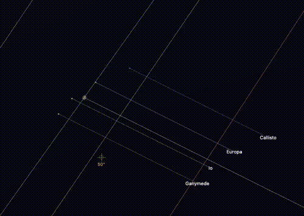

# Once Around the Night Sky

An interactive celestial visualizer for Paul Fellows' excellent [Once Around](https://www.youtube.com/@oncearound) series of astronomy YouTube videos.

<p align="center">
  <a href="https://once-around.pages.dev">
    
  </a>
</p>

## Live Demo

**[once-around.pages.dev](https://once-around.pages.dev)**

## Features

### Sky Rendering
- **~8,400 stars** from the Yale Bright Star Catalog — every naked-eye star, with accurate magnitudes
- **Milky Way** procedurally rendered based on galactic coordinates
- **88 constellations** with IAU-standard lines and labels
- **Stellar scintillation** (twinkling) simulation in topocentric mode

### Solar System
- **Planets** with real-time positions via VSOP87 theory
- **Planetary moons** — Jupiter (4), Saturn (6), Uranus (5), Neptune (1), Mars (2)
- **Dwarf planets & small bodies** — Pluto, Ceres, Eris, Makemake, Haumea, TNOs (Sedna, Quaoar, and more), asteroids, and the NEOs Apophis and Bennu, all on JPL Horizons osculating elements
- **Comets** — Halley, NEOWISE, Hale-Bopp, Tsuchinshan-ATLAS, the Great Comet of 1811, Ikeya-Seki, and more, with anti-solar tails
- **Orbital paths** showing apparent motion against the stars

### Guided Tours
**23 planetarium-style tours** with keyframe animation: historic eclipses (1919 Eddington, 585 BCE Battle of Halys), great comets, historical supernovae (SN 1054, Tycho, Kepler, SN 1987A), Venus/Mercury transits, discovery moments (Galileo's moons, Uranus, Neptune, Pluto), and space mission moments (Apollo 8 Earthrise, Voyager 1's Pale Blue Dot). Deep-linkable via `?tour=...`.

### Eclipse Toolkit
- Upcoming-eclipse banner with **center-line paths** for the 2026 (Spain), 2027 (Egypt), and 2028 (Australia) total eclipses
- **"Navigate to path"** — jump your observer to the nearest point on the center line
- **Local circumstances** — distance from the center line and estimated totality duration
- **3D ground tracks** rendered on the Earth globe

### View Modes
- **Geocentric** — Explore the celestial sphere from Earth's center
- **Topocentric** — Your local sky with horizon, Alt/Az coordinates
- **Hubble** — Ride the telescope in LEO, with Sun-avoidance zone, South Atlantic Anomaly, and orbital-path overlays
- **JWST** — View from L2 with field-of-regard overlay
- **FGS guide star lock** (`G`) — lock onto a guide star and track it, telescope-style

### Deep Sky Objects
- **30 deep field images** from Hubble and JWST at actual sky positions
- **DSO markers** for galaxies, nebulae, and star clusters with info popups

### Satellites & Meteor Showers
- **ISS and Hubble** tracking with real-time positions and shadow state
- **ISS pass predictions** for your location, with a staleness warning if ephemeris data is out of date (data auto-refreshes weekly from NASA Horizons)
- **13 meteor showers** with radiant markers during active periods

### Additional Features
- **Search** — Find any star, planet, constellation, DSO, or satellite
- **Time controls** — Scrub through time to watch celestial motion
- **Video markers** — Links to relevant Once Around episodes
- **AR mode** — Use device orientation to explore (mobile)
- **Night vision** — Red-only mode for outdoor observing
- **PWA** — Installable, works offline
- **URL deep linking** — Share any view, time, or tour

## Accuracy

The astronomy engine is regression-tested against **JPL Horizons** reference data (checked in, runs offline): planets and Pluto within 3′, the Moon within 2.5′ geocentric / 6′ topocentric, minor bodies within 3′ at their element epoch (Ceres at 0.21′), comets within 1°. Tolerances are derived from measured residuals and documented per body, including honest caveats where two-body propagation drifts (main-belt asteroids by 2030, NEOs across Earth encounters). These suites run in CI on every PR.

## Controls

| Action | Input |
|--------|-------|
| Look around | Click and drag |
| Zoom | Scroll wheel or pinch |
| Search | `/` |
| Help / shortcut list | `?` |
| Toggle labels | `L` |
| Toggle constellations | `C` |
| Toggle video markers | `V` |
| Toggle DSOs | `D` |
| Toggle deep fields | `F` |
| Toggle orbits | `O` |
| Toggle meteor showers | `M` |
| Toggle horizon | `H` |
| Night vision mode | `R` |
| Guide star lock (telescope modes) | `G` |
| Next eclipse | `E` |
| Jump to now | `N` |
| Play/pause time | `P` |
| Step time | `←` / `→` |
| Fly to galactic center | `Space` |

## Tech Stack

- **Frontend**: TypeScript, Three.js, Vite
- **Astronomy Engine**: Rust compiled to WebAssembly
  - VSOP87 planetary theory, Meeus lunar theory
  - Orbital-element propagation for comets, minor bodies, and planetary moons
  - Yale Bright Star Catalog (BSC5) data
- **Data pipeline**: NASA Horizons ephemerides (satellites auto-refresh weekly via GitHub Actions)
- **CI**: web typecheck + unit tests, Rust engine test suites (including Horizons accuracy validation)
- **Deployment**: Cloudflare Pages

## Project Structure

```
once-around/
├── apps/web/              # Three.js frontend application
├── crates/
│   ├── sky_engine/        # WASM bindings
│   └── sky_engine_core/   # Core astronomy calculations (Rust)
├── data/                  # Star catalog, ephemerides, and pipeline intermediates
├── scripts/               # Data pipeline (ephemerides, catalogs, transcripts)
├── docs/                  # Project documentation
└── tests/                 # Playwright end-to-end tests
```

The `scripts/` directory holds two generations of data tooling:

- **Routine / current pipeline** — the path used for ongoing updates: transcript
  scraping (`get_transcripts.sh`, `scrape_transcripts.js`) and catalog building
  (`build_catalog.js`), plus satellite ephemeris generation
  (`generate_satellite_ephemeris.py`, auto-refreshed weekly). Catalog changes are
  applied by hand-editing `data/catalog.json` / `data/final_placements.json` and
  re-running `generate-videos-json.js` (produces `apps/web/public/videos.json`)
  and `generate_table.js` (produces `data/catalog.csv`).
- **One-time catalog-bootstrap chain** — `create_placement_data.js` (stage 1) →
  `create_final_placements.js` (stage 2) originally produced the initial
  `data/final_placements.json` / `data/video_placements.json`. It is superseded
  for incremental updates by the routine path above and is kept only so the
  catalog can be rebuilt from scratch if ever needed (see the header comments in
  each script).

## Development

```bash
# Install dependencies
pnpm install

# Build WASM module (required before dev/test)
pnpm build:wasm

# Start dev server
pnpm dev

# Type-check and run web unit tests
pnpm typecheck
pnpm test:unit

# Run the Rust engine test suites
cargo test -p sky_engine_core

# Playwright end-to-end tests
pnpm test

# Build for production
pnpm build:all

# Deploy to Cloudflare
pnpm deploy:prod
```

## Documentation

- [ROADMAP.md](ROADMAP.md) — planned features and known technical debt
- [docs/COMPLETED_FEATURES.md](docs/COMPLETED_FEATURES.md) — detailed record of implemented features

## Credits

- [Paul Fellows / Once Around](https://www.youtube.com/@oncearound) for the inspiring video series
- Yale Bright Star Catalog for star data
- VSOP87 theory by Pierre Bretagnon and Gerard Francou
- [NASA/JPL Horizons](https://ssd.jpl.nasa.gov/horizons/) for ephemerides and reference data
- NASA GSFC / Fred Espenak for eclipse path predictions

## License

MIT
